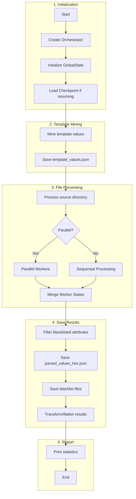
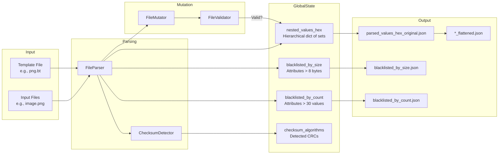
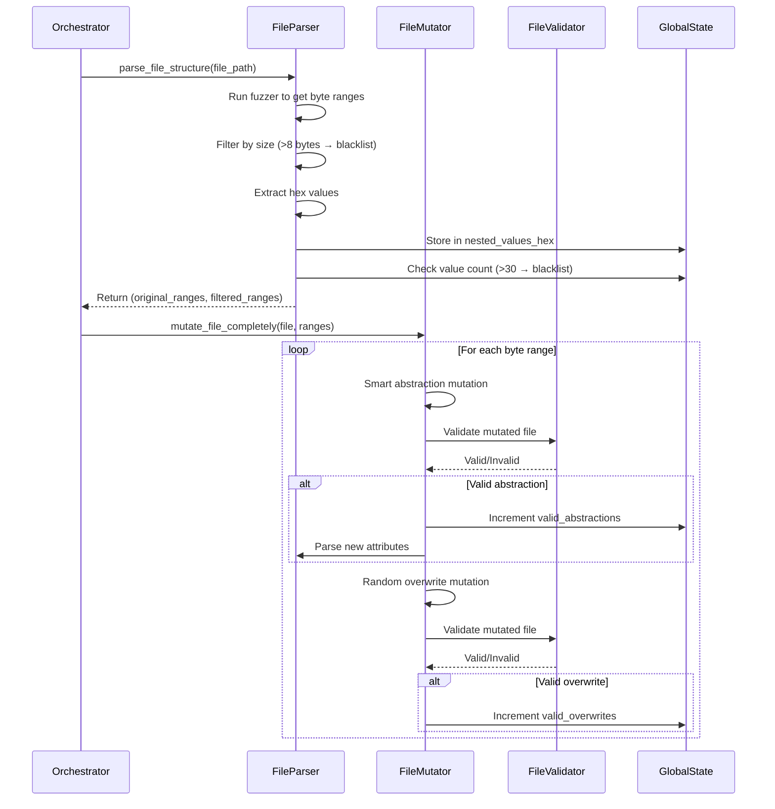
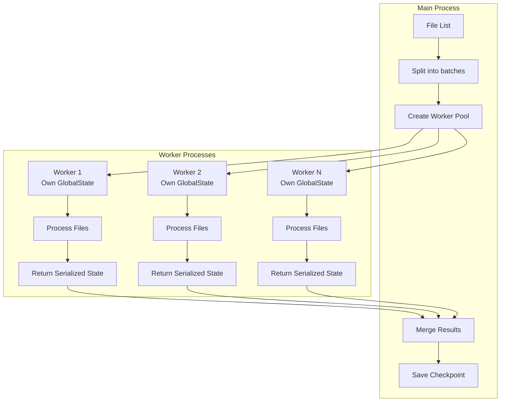
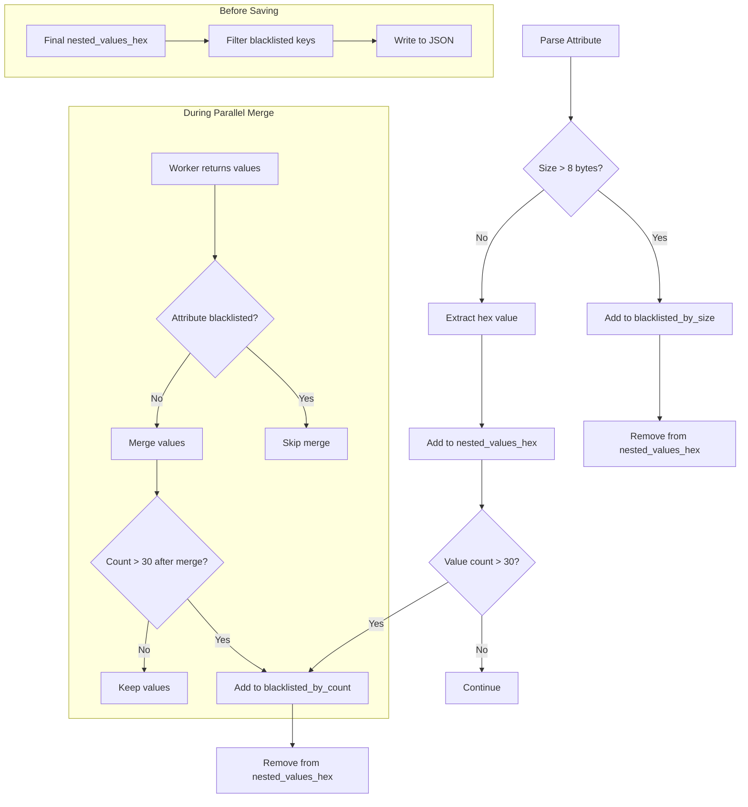

# Learning Constraints Module

A modular system for file format fuzzing and constraint discovery through systematic analysis. This module provides tools for parsing file structures, performing mutations, and discovering format constraints.

## Quick Start

```python
from learning_constraints import LearningConstraintsOrchestrator

# Process PNG files
orchestrator = LearningConstraintsOrchestrator(file_type="png")
results = orchestrator.run_complete_process()
```

## Command Line Usage

```bash
# Process BMP files
python run_learning_constraints.py bmp

# Process 10 PNG files
python run_learning_constraints.py png 10
```

## Module Architecture

```
learning_constraints/
├── main.py              # Orchestrator - coordinates entire process
├── config.py            # Configuration and GlobalState
├── parsers.py           # File parsing and value extraction
├── mutators.py          # File mutation (abstraction & overwrite)
├── validators.py        # File format validation
├── parallel.py          # Multi-process parallel execution
├── checkpoint.py        # Progress saving/resuming
├── transformers.py      # Result JSON transformation
├── result_saver.py      # Result file saving
├── statistics.py        # Statistics reporting
├── checksum_detector.py # CRC/checksum detection
└── utils.py             # Shared utility functions
```

## Processing Flow

### Complete Process Flow

```
START
  │
  ▼
┌─────────────────────────────────────────────────────────────────┐
│ 1. INITIALIZATION                                               │
│    Orchestrator → GlobalState → CheckpointManager               │
│    (Load checkpoint if resuming)                                │
└─────────────────────────────────────────────────────────────────┘
  │
  ▼
┌─────────────────────────────────────────────────────────────────┐
│ 2. TEMPLATE MINING                                              │
│    FileParser.mine_interesting_values_from_template()           │
│    Template (png.bt) → ffcompile → Extract predefined values    │
│    → Save template_values.json                                  │
└─────────────────────────────────────────────────────────────────┘
  │
  ▼
┌─────────────────────────────────────────────────────────────────┐
│ 3. FILE PROCESSING (for each file in directory)                 │
│                                                                 │
│    ┌─────────────┐     ┌─────────────┐     ┌─────────────┐     │
│    │  Worker 1   │     │  Worker 2   │     │  Worker N   │     │
│    │ (parallel)  │     │ (parallel)  │ ... │ (parallel)  │     │
│    └──────┬──────┘     └──────┬──────┘     └──────┬──────┘     │
│           │                   │                   │             │
│           └───────────────────┴───────────────────┘             │
│                               │                                 │
│                               ▼                                 │
│                      Merge Worker States                        │
│                      Enforce Blacklist Limits                   │
└─────────────────────────────────────────────────────────────────┘
  │
  ▼
┌─────────────────────────────────────────────────────────────────┐
│ 4. SAVE RESULTS                                                 │
│    Filter blacklisted → Save JSON files → Transform/flatten     │
└─────────────────────────────────────────────────────────────────┘
  │
  ▼
END (Print statistics)
```

### Single File Processing

```
INPUT FILE (e.g., image.png)
  │
  ▼
┌─────────────────────────────────────────────────────────────────┐
│ PARSE: FileParser.parse_file_structure()                        │
│                                                                 │
│   Run fuzzer → Get byte ranges with attributes                  │
│        │                                                        │
│        ▼                                                        │
│   For each attribute:                                           │
│        │                                                        │
│        ├── Size > 8 bytes? ──YES──► Add to blacklisted_by_size  │
│        │                           (skip this attribute)        │
│        │                                                        │
│        └── NO ─► Extract hex value                              │
│                       │                                         │
│                       ▼                                         │
│                  Store in nested_values_hex                     │
│                       │                                         │
│                       ▼                                         │
│                  Count > 30? ──YES──► Add to blacklisted_by_count│
│                       │              (remove values)            │
│                       │                                         │
│                       └── NO ─► Keep values                     │
│                                                                 │
│   Also: Detect checksums/CRCs (ChecksumDetector)                │
└─────────────────────────────────────────────────────────────────┘
  │
  ▼
┌─────────────────────────────────────────────────────────────────┐
│ MUTATE: FileMutator.mutate_file_completely()                    │
│                                                                 │
│   For each byte range (not blacklisted):                        │
│        │                                                        │
│        ├── Smart Abstraction Mutation                           │
│        │        │                                               │
│        │        ▼                                               │
│        │   Modify bytes → Validate (FileValidator)              │
│        │        │                                               │
│        │        ├── VALID ──► Save special file                 │
│        │        │             Parse for new attributes          │
│        │        │             Increment valid_abstractions      │
│        │        │                                               │
│        │        └── INVALID ─► Discard                          │
│        │                                                        │
│        └── Random Overwrite Mutation                            │
│                 │                                               │
│                 ▼                                               │
│            Overwrite with random bytes → Validate               │
│                 │                                               │
│                 ├── VALID ──► Increment valid_overwrites        │
│                 │                                               │
│                 └── INVALID ─► Discard                          │
└─────────────────────────────────────────────────────────────────┘
  │
  ▼
NEXT FILE (or END if no more files)
```

### Blacklisting Flow

```
Attribute parsed
      │
      ▼
 Size > 8 bytes? ───YES───► blacklisted_by_size
      │                            │
      NO                           ▼
      │                     Remove from values
      ▼                     Skip in mutations
 Add value to set
      │
      ▼
 Count > 30? ───────YES───► blacklisted_by_count
      │                            │
      NO                           ▼
      │                     Remove all values
      ▼                     Skip in mutations
 Keep value
      │
      ▼
 [During parallel merge]
      │
 Already blacklisted? ─YES─► Skip merge (don't add new values)
      │
      NO
      │
      ▼
 Merge worker values
      │
      ▼
 Count > 30 now? ───YES───► blacklisted_by_count
      │
      NO
      │
      ▼
 Keep merged values
```

## Key Data Structures

### GlobalState

Holds all collected data during processing:

| Field                      | Type          | Description                                       |
| -------------------------- | ------------- | ------------------------------------------------- |
| `nested_values_hex`        | `defaultdict` | Hierarchical dict → set of hex values             |
| `blacklisted_by_size`      | `set`         | Attributes > MAX_ATTRIBUTE_SIZE_BYTES (8)         |
| `blacklisted_by_count`     | `set`         | Attributes > MAX_UNIQUE_VALUES_PER_ATTRIBUTE (30) |
| `checksum_algorithms`      | `dict`        | Detected CRC types per chunk                      |
| `valid_abstractions_count` | `int`         | Successful abstraction mutations                  |
| `valid_overwrites_count`   | `int`         | Successful overwrite mutations                    |

### ByteRange (dataclass)

Represents a parsed attribute with byte positions:

```python
@dataclass
class ByteRange:
    start: int        # Start byte offset
    end: int          # End byte offset
    attribute: str    # Full attribute path (e.g., "file~chunk~data")

    @property
    def size(self) -> int
    @property
    def cleaned_key(self) -> str
    def is_within_size_limit(self) -> bool
```

## Module Responsibilities

| Module                   | Responsibility                                          |
| ------------------------ | ------------------------------------------------------- |
| **main.py**              | High-level orchestration, coordinates workflow          |
| **config.py**            | Configuration constants, GlobalState class              |
| **parsers.py**           | Parse files with fuzzer, extract byte ranges and values |
| **mutators.py**          | Mutation strategies (abstraction, overwrite)            |
| **validators.py**        | Validate files using external tools (ImageMagick, etc.) |
| **parallel.py**          | Multi-process execution, state merging                  |
| **checkpoint.py**        | Save/restore progress for resumability                  |
| **transformers.py**      | Flatten nested JSON results                             |
| **result_saver.py**      | Write all result files to disk                          |
| **statistics.py**        | Print processing statistics                             |
| **checksum_detector.py** | Detect CRC algorithms in file chunks                    |
| **utils.py**             | Shared helpers (key cleaning, byte operations)          |

## Configuration

Key settings in `config.py`:

| Setting                           | Default | Description                           |
| --------------------------------- | ------- | ------------------------------------- |
| `MAX_ATTRIBUTE_SIZE_BYTES`        | 8       | Blacklist attributes larger than this |
| `MAX_UNIQUE_VALUES_PER_ATTRIBUTE` | 30      | Blacklist attributes with more values |
| `PARALLEL_WORKERS`                | 10      | Number of parallel workers            |
| `CHECKPOINT_SAVE_INTERVAL`        | 10      | Save checkpoint every N files         |
| `ENABLE_CHECKSUM_DETECTION`       | True    | Detect CRC algorithms                 |

## Supported File Types

- **Images**: GIF, JPG, PNG, BMP
- **Audio**: MP3, WAV
- **Video**: MP4, AVI
- **Archives**: ZIP
- **Network**: PCAP
- **Music**: MIDI

## Requirements

- **ImageMagick**: For image validation
- **FFmpeg**: For audio/video validation
- **Wireshark**: For PCAP validation
- **TiMidity**: For MIDI validation
- **Format-specific fuzzers**: `{file_type}-fuzzer` executables

## Detailed Flow Diagrams (Mermaid)

For interactive visualization, these Mermaid diagrams provide detailed views of each process.

### Execution Flow Overview



### Data Flow Diagram



### Single File Processing Flow



### Parallel Processing Flow



### Blacklisting Logic



## Documentation

For comprehensive documentation, usage examples, and detailed explanations, see:
**[README_LEARNING_CONSTRAINTS_COMPREHENSIVE.md](../README_LEARNING_CONSTRAINTS_COMPREHENSIVE.md)**
